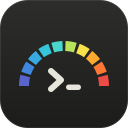
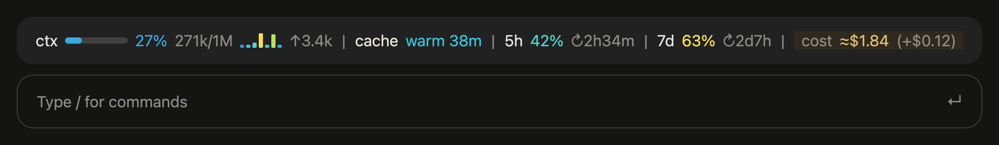
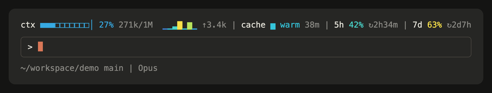
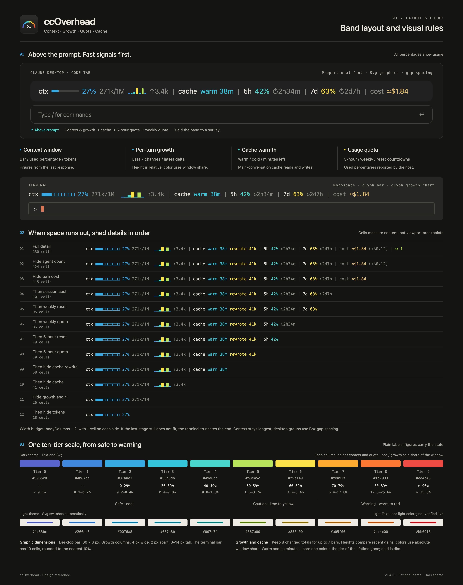
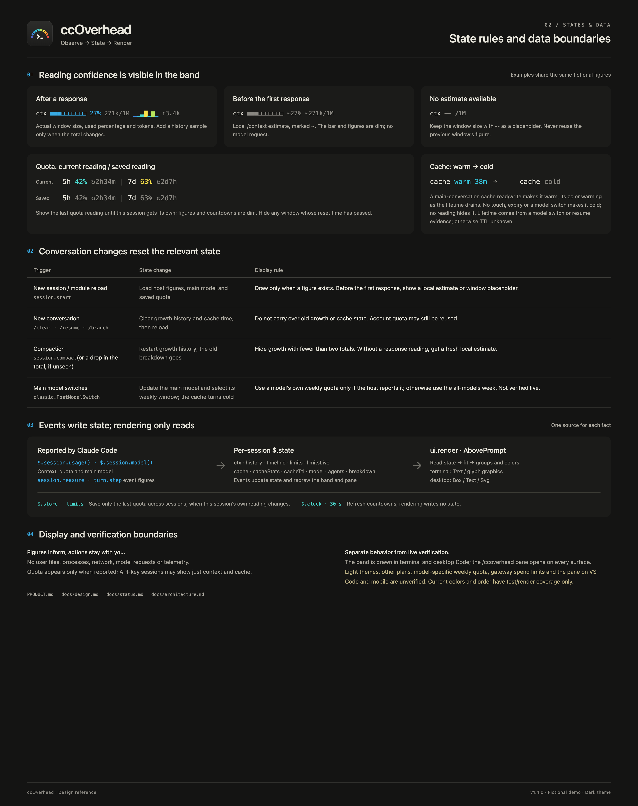

<p align="center">
  
</p>

<h1 align="center">ccOverhead</h1>

<p align="center">
  Your Claude Code overhead, right overhead.<br>
  Context, each turn's growth, quota and cache warmth in one band above the prompt.
</p>

<p align="center">
  <strong>English</strong> | <a href="README.zh-CN.md">简体中文</a>
</p>

<p align="center">
  <a href="https://github.com/shengyy/ccoverhead/actions/workflows/ci.yml"></a>
  <a href="https://github.com/shengyy/ccoverhead/releases"></a>
  <a href="LICENSE"></a>
</p>

<p align="center"><a href="https://shengyy.github.io/ccoverhead/"><strong>Website</strong></a></p>

<p align="center">
  
</p>

---

While you work in Claude Code, a few numbers decide what you should do next: how full the context window
is (time to `/compact`?), how fast it is filling, how much of your 5-hour and weekly quota is left, and
whether the prompt cache is still warm. ccOverhead is a Claude Code mod (a plugin of function
hooks) that keeps all of them in one band right above the prompt, colored on a single scale from safe to warning.

## Features

- **Context at a glance.** A bar, the used percentage and `used/window` tokens. Before the first response
  of a session (or after `/clear` or compaction) it shows Claude Code's own `/context` estimate, marked
  `~`, instead of a blank.
- **Each turn's growth.** A seven-bar chart of what every recent turn added to the context, plus the last
  turn's `↑` figure. Each bar is colored by its share of the window, so a heavy turn stands out.
- **Quota with reset countdowns.** The 5-hour and weekly windows, as a percentage used and the time until
  each resets.
- **Prompt-cache warmth.** Whether the last main-conversation request hit the cache and how long it stays
  warm, so you know when a pause will cost a cache rewrite.
- **One color language.** Cool means safe, yellow means caution, warm to red means warning, the same for
  every number in the band. The scale stays readable for red-green color-blind users.
- **Terminal and desktop.** One line of text in the terminal; crisp vector bars in the Claude desktop app,
  where block characters would not line up.
- **Private and free.** It only reads figures Claude Code already reports. No files, no network, no model
  requests, no telemetry.

<p align="center">
  
</p>

## Requirements

- Claude Code 2.1.288 or later, with mods (function-hook plugins). Verified versions are in
  [docs/status.md](docs/status.md).
- The band is drawn in the terminal and in the Claude desktop app's Code tab. Quota appears on Claude
  subscription plans, which report rate limits; API-key sessions show context and cache only.

## Install

In Claude Code:

```text
/plugin marketplace add shengyy/ccoverhead
/plugin install ccoverhead@ccoverhead
/reload-plugins
```

Update with `/plugin marketplace update ccoverhead`, then `/plugin update ccoverhead@ccoverhead`.
Remove with `/plugin uninstall ccoverhead@ccoverhead`.

## Use

The band reads left to right, from what changes every turn to what changes slowly:

```text
ctx ■■■□□□□□□□ 27% 271k/1M  ▁▂▄█▂▇▁ ↑3.4k | 5h 42% ↻2h34m | 7d 63% ↻2d7h | cache warm 38m
```

| Group | Meaning |
|---|---|
| `ctx` | Context used: bar, percentage, tokens. `~` marks the pre-response estimate |
| Bars and `↑` | What each of the last seven turns added; `↑` is the latest turn |
| `5h`, `7d` | Quota used in each window, and `↻` the time until it resets. Dim when remembered from an earlier session. `7d` follows the main model's own weekly window when Claude Code reports one, such as `7d fable` (not verified) |
| `cache` | `warm` with the minutes left on the cache, or `cold` |

Colors follow one ten-step scale from cool to warm. Percentages (context and quota) move one step per 10%
from sky blue at 0–29% to red at 90% and above; each growth bar takes a step by its share of the window,
doubling from 0.1%. The full table is in [docs/design.md](docs/design.md#color-scale). On a narrow window
the band drops the chart, then the cache, then details, keeping the context longest.

## Design rationale

Four signals, one quiet band. A shared cool-to-warm scale makes context pressure, heavy turns and quota
use readable at a glance. On narrow windows, secondary details yield first so context stays visible.

The diagrams below illustrate layout, color thresholds and state rules using fictional figures. See
[the design specification](docs/design.md) for the rules and how to regenerate them.

<p align="center">
  
</p>

<p align="center">
  
</p>

## How it works

ccOverhead is a plugin of function hooks. It draws the `AbovePrompt` site, reads the context and rate
limits that Claude Code reports after each turn (`session.measure`, `$.session.usage`), and watches each
main-conversation request's cache usage (`turn.step`). Everything it shows is a figure Claude Code
already has; nothing is computed from your files or sent anywhere. The Claude Code facts it relies on, and
the version each was checked on, are in [docs/claude-code-integration.md](docs/claude-code-integration.md).

## Privacy

ccOverhead makes no network requests and no model requests, and reads no files. It keeps the session's
figures in memory and stores only the last quota reading in Claude Code's plugin store, so a new session
can show it until its own arrives. Details: [SECURITY.md](SECURITY.md).

ccOverhead is an independent project and is not affiliated with or endorsed by Anthropic. "Claude" and
"Claude Code" are trademarks of Anthropic, PBC.

## Contributing

Issues and pull requests are welcome. Start with [CONTRIBUTING.md](CONTRIBUTING.md), the product rules in
[PRODUCT.md](PRODUCT.md) and the [docs](docs/README.md).

## License

[MIT](LICENSE)
