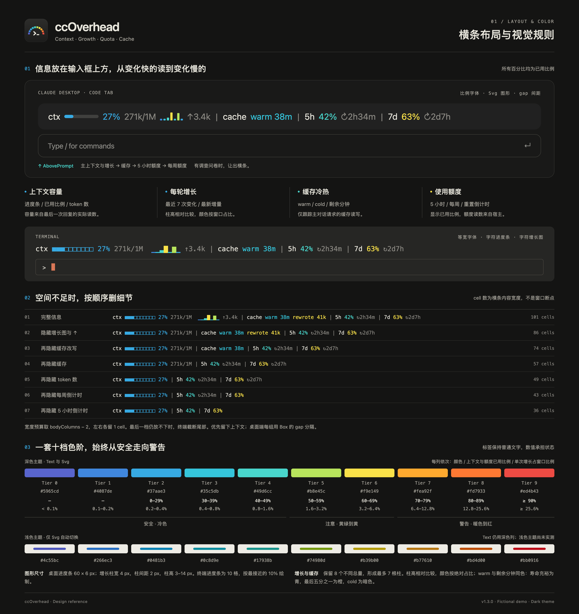
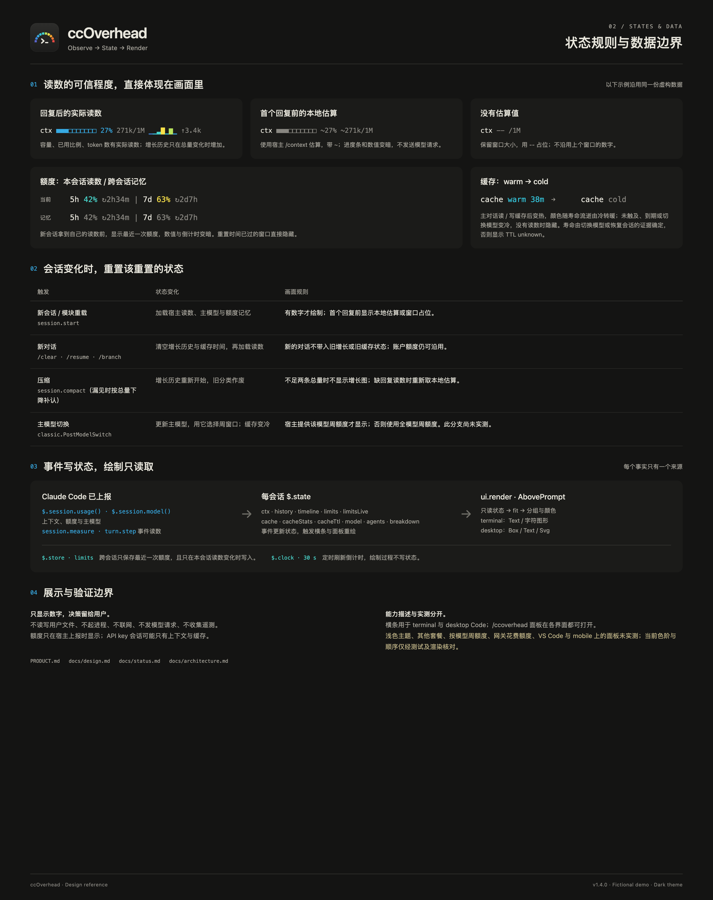

<p align="center">
  
</p>

<h1 align="center">ccOverhead</h1>

<p align="center">
  Claude Code 的开销，就悬在你头顶。<br>
  上下文、每轮增长、额度和缓存冷热，一条横条显示在输入框上方。
</p>

<p align="center">
  <a href="README.md">English</a> | <strong>简体中文</strong>
</p>

<p align="center">
  <a href="https://github.com/shengyy/ccoverhead/actions/workflows/ci.yml"></a>
  <a href="https://github.com/shengyy/ccoverhead/releases"></a>
  <a href="LICENSE"></a>
</p>

<p align="center">
  
</p>

---

在 Claude Code 里干活时，有几个数字决定你下一步该做什么：上下文窗口满了多少（该 `/compact` 了吗？）、涨得有多快、5 小时和每周额度还剩多少、prompt 缓存还热不热。ccOverhead 是一个 Claude Code mod（由函数钩子组成的插件），把这些数字放进输入框正上方的一条横条里，全部用同一条从安全到警告的色阶上色。

## 功能

- **上下文一眼看清**：进度条、已用百分比和「已用/窗口」token 数。新会话第一个回复之前（以及 `/clear`、compact 之后）显示 Claude Code 自己的 `/context` 估算值，前面带 `~`，不会是空白。
- **每轮增长**：一组七根柱子，显示最近每一轮给上下文加了多少，`↑` 是最后一轮的增量。每根柱子按它占窗口的比例上色，重的一轮会很显眼。
- **额度与重置倒计时**：5 小时和每周两个窗口的已用百分比，以及各自距离重置还有多久。
- **prompt 缓存冷热**：主对话上一次请求有没有命中缓存、还能热多久，让你知道停下来多久会导致重写缓存。
- **一套颜色语言**：冷色是安全，黄色是注意，暖色到红是警告，横条里每个数字都一样。红绿色弱用户也能分清。
- **终端和桌面端**：终端里是一行文字；在 Claude 桌面端，字符图形对不齐，改为清晰的矢量图形。
- **私密、免费**：只读取 Claude Code 已经上报的数字。不读文件、不联网、不发模型请求、不收集任何数据。

<p align="center">
  
</p>

## 要求

- Claude Code 2.1.288 或更新版本，支持 mod（函数钩子插件）。已验证的版本见 [docs/status.md](docs/status.md)。
- 横条在终端和 Claude 桌面端的 Code 标签里显示。额度只在会上报用量限制的 Claude 订阅套餐下出现；使用 API key 的会话只显示上下文和缓存。

## 安装

在 Claude Code 里执行：

```text
/plugin marketplace add shengyy/ccoverhead
/plugin install ccoverhead@ccoverhead
/reload-plugins
```

更新：先 `/plugin marketplace update ccoverhead`，再 `/plugin update ccoverhead@ccoverhead`。卸载：`/plugin uninstall ccoverhead@ccoverhead`。

## 使用

横条从左到右，依次是每轮都在变的、变化慢的：

```text
ctx ■■■□□□□□□□ 27% 271k/1M  ▁▂▄█▂▇▁ ↑3.4k | 5h 42% ↻2h34m | 7d 63% ↻2d7h | cache warm 38m
```

| 组 | 含义 |
|---|---|
| `ctx` | 上下文用量：进度条、百分比、token 数。`~` 表示第一个回复前的估算值 |
| 柱子和 `↑` | 最近七轮各自加了多少；`↑` 是最后一轮 |
| `5h`、`7d` | 各窗口的额度已用比例，`↻` 是距离重置的时间。暗色表示沿用上一个会话的读数。Claude Code 上报了当前主模型自己的周额度时，`7d` 改显示它，例如 `7d fable`（未验证） |
| `cache` | `warm` 加缓存剩余分钟数，或 `cold` |

颜色是同一条从冷到暖的 10 档色阶。百分比（上下文和额度）每 10% 升一档：0–29% 天蓝，90% 及以上深红；每根增长柱按它占窗口的比例落档，从 0.1% 起每翻一倍升一档。完整对照表见 [docs/design.md](docs/design.md#color-scale)。窗口变窄时，横条依次省掉柱状图、缓存和其它细节，上下文保留得最久。

## 设计理念

四种信号，放进一条安静的横条。同一套从冷到暖的色阶，让上下文压力、重的一轮和额度用量都能一眼看清。窗口变窄时先删次要细节，把上下文留到最后。

下面的设计图用虚构数据说明布局、色阶阈值与状态规则。完整规则与生成方式见[设计说明](docs/design.md)。

<p align="center">
  
</p>

<p align="center">
  
</p>

## 原理

ccOverhead 是一个函数钩子插件。它绘制输入框上方的 `AbovePrompt` 区域，读取 Claude Code 每轮结束后上报的上下文和用量限制（`session.measure`、`$.session.usage`），并观察主对话每次请求的缓存用量（`turn.step`）。显示的每个数字都是 Claude Code 本来就有的，不从你的文件里计算，也不发往任何地方。它依赖的 Claude Code 行为，以及每条在哪个版本上验证过，见 [docs/claude-code-integration.md](docs/claude-code-integration.md)。

## 隐私

ccOverhead 不发任何网络请求和模型请求，也不读文件。会话期间的数字只放在内存里；唯一持久保存的是最近一次额度读数，存在 Claude Code 的插件存储里，新会话在拿到自己的读数之前先显示它。详见 [SECURITY.md](SECURITY.md)。

ccOverhead 是独立项目，与 Anthropic 无关联，也未获其背书。「Claude」和「Claude Code」是 Anthropic, PBC 的商标。

## 参与贡献

欢迎提 issue 和 pull request。请先读 [CONTRIBUTING.md](CONTRIBUTING.md)、[PRODUCT.md](PRODUCT.md) 里的产品规则和[文档目录](docs/README.md)。

## 许可证

[MIT](LICENSE)
